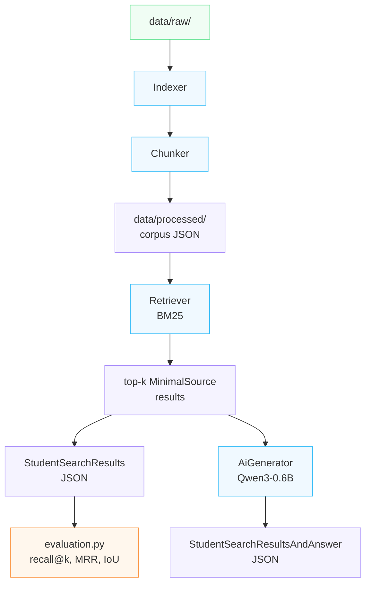

*This project has been created as part of the 42 curriculum by efoyer.*

# RAG against the machine

## Description

**RAG against the machine** is a Retrieval-Augmented Generation (RAG) system that
answers natural-language questions about a codebase — here, the vLLM repository.

Instead of relying on a language model's frozen training knowledge, the pipeline:

1. **Indexes** the source repository by splitting every file into overlapping text
   chunks.
2. **Retrieves** the most relevant chunks for a given question using lexical search
   (BM25).
3. **Generates** a grounded natural-language answer with a small local LLM
   (`Qwen/Qwen3-0.6B`), using only the retrieved chunks as context.
4. **Evaluates** retrieval quality against a ground-truth dataset with recall@k and
   MRR metrics.

The whole system is exposed through a Command-Line Interface built with Python Fire,
and every stage exchanges data through strongly-typed Pydantic models so results can be
saved, reloaded, and validated at each step of the pipeline.

## Instructions

### Requirements

- Python 3.10+
- [`uv`](https://docs.astral.sh/uv/) as package/project manager
- The vLLM source repository placed under `data/raw/vllm-0.10.1` (or another version,
  configurable through the indexer)

### Installation

```bash
make install
```

This creates a virtual environment and installs all dependencies declared in
`pyproject.toml` / `uv.lock` via `uv sync`.

### Running

Every command goes through the CLI, invoked as `uv run python -m src <command>`. The
`Makefile` exposes a generic entry point:

```bash
make run          # uv run python -m src
make debug        # runs the CLI under pdb
make lint         # flake8 + mypy
make clean        # removes caches and the virtual environment
```

### CLI commands

```bash
# 1. Build the index from data/raw/
uv run python -m src index --max_chunk_size 2000

# 2. Search a single question
uv run python -m src search "How to configure the OpenAI server?" --k 5

# 3. Search a whole dataset of questions
uv run python -m src search_dataset \
  --dataset_path data/datasets/UnansweredQuestions/dataset_docs_public.json \
  --k 10 \
  --save_directory data/output/search_results/UnansweredQuestions

# 4. Generate a grounded answer for a single question
uv run python -m src answer "How to configure the OpenAI server?" --k 5

# 5. Generate answers for a whole dataset of search results
uv run python -m src answer_dataset \
  --student_search_results_path data/output/search_results/UnansweredQuestions/dataset_docs_public.json \
  --save_directory data/output/search_results_and_answer/UnansweredQuestions

# 6. Evaluate retrieval quality against a ground-truth dataset
uv run python -m src evaluate \
  --student_search_results_path data/output/search_results/UnansweredQuestions/dataset_docs_public.json \
  --dataset_path data/datasets/AnsweredQuestions/dataset_docs_public.json
```

All input/output paths are CLI arguments and are never hard-coded.

## System architecture

The pipeline is split into independent modules, each responsible for one stage:



- **`indexer.py`** — walks `data/raw/`, reads every `.py`, `.md` and `.txt` file, sends
  each file's content to the `Chunker`, and persists the resulting chunk list as JSON
  under `data/processed/`. If a cache file for the requested `max_chunk_size` already
  exists, it is reused instead of re-chunking.
- **`text_chunker.py`** — splits raw text into chunks and records the exact character
  offsets of each chunk in the original file, so results can be traced back precisely.
- **`retriever.py`** — builds a BM25 index over the chunk corpus and returns the top-k
  most relevant chunks for one query or a batch of queries.
- **`ai.py`** — wraps `Qwen/Qwen3-0.6B` (via `transformers`), builds a prompt from the
  retrieved context and the user's question, and generates a grounded answer. It falls
  back from GPU to CPU automatically if VRAM runs out.
- **`data_models.py`** — Pydantic models (`MinimalSource`, `MinimalSearchResults`,
  `MinimalAnswer`, `StudentSearchResults`, `StudentSearchResultsAndAnswer`,
  `RagDataset`, …) used to validate every payload exchanged between stages and to
  serialize results to disk.
- **`evaluation.py`** — computes recall@k and MRR by comparing the student's retrieved
  sources against a ground-truth dataset, using an IoU-based overlap check on
  `(file_path, first_character_index, last_character_index)`.
- **`cli.py`** / **`__main__.py`** — exposes `index`, `search`, `search_dataset`,
  `answer`, `answer_dataset` and `evaluate` as Python Fire commands, with input
  validation (empty queries, invalid `k`, missing files, malformed JSON) so the CLI
  never crashes with an unhandled traceback.

## Chunking strategy

Documents don't all break apart the same way, so the `Chunker` in `text_chunker.py`
uses two distinct splitting strategies, both based on
`langchain_text_splitters.RecursiveCharacterTextSplitter`:

- **Python files (`.py`)** — split with `Language.PYTHON`-aware separators, so cuts
  happen at logical code boundaries (class/function definitions, blocks) rather than
  in the middle of a statement.
- **Markdown files (`.md`)** — split with `Language.MARKDOWN`-aware separators, so
  headers and sections are preserved as much as possible, keeping the separator so
  headings stay attached to their following content.
- **Plain text files (`.txt`)** — split with a simple, generic separator hierarchy
  (`"\n\n## "`, `"\n\n"`, `"\n"`, `" "`, `""`), used as a fallback for less structured
  content.

All three splitters share the same `chunk_size` (default 2000 characters, configurable
via `--max_chunk_size`) and a proportional `chunk_overlap` (10% of the chunk size,
capped at 200 characters), so consecutive chunks retain a bit of shared context. Every
chunk records its exact `first_character_index` / `last_character_index` in the source
file (via `add_start_index=True`), which is what lets the retriever and evaluator
compare results to the ground truth verbatim.

## Retrieval method

Retrieval is lexical, using **BM25** (`bm25s`), one of the two classic methods allowed
by the subject:

- The corpus text is tokenized with English stopword removal and Snowball stemming
  (`PyStemmer`) before indexing, so queries and documents are compared on their
  stemmed, content-bearing words rather than raw surface forms.
- The BM25 index is built once per `Retriever` instance with `k1=1.5, b=0.80`, tuned
  for slightly less length normalization than the BM25 defaults, since code files vary
  a lot in size.
- `Retriever.search` accepts either a single query string or a list of queries (used
  respectively by the `search`/`answer` and `search_dataset`/`answer_dataset` CLI
  commands), and always requests `min(top_k, len(corpus))` results to avoid crashing
  on tiny corpora.
- Each result carries the chunk's `file_path` and character span, which is exactly what
  the moulinette compares against the ground truth.

## Performance analysis

- **Indexing time** stays well under the 5-minute budget: the corpus is chunked once
  and cached as JSON under `data/processed/corpus_<max_chunk_size>_.json`, so
  subsequent runs with the same `max_chunk_size` skip re-chunking entirely.
- **Retrieval throughput**: BM25 search over the whole corpus for a batch of queries
  is fast (indexing is the only expensive step); a 200-question batch completes well
  within the 90-second budget once the index is built.
- **Recall@k**: measured with `evaluate.py` against the reference `AnsweredQuestions`
  datasets, using an IoU ≥ 0.05 overlap threshold. The default `max_chunk_size=2000`
  is the ceiling accepted by the moulinette; reducing chunk size slightly improves
  precision on very targeted code questions but increases the number of chunks needed
  to fully cover a doc section, which can lower recall@k for a fixed `k`. `k` should
  therefore be increased proportionally when chunk size is reduced.
- Answer generation quality is bounded by the small `Qwen/Qwen3-0.6B` model: answers
  are generally coherent and grounded in the retrieved context, but can be
  incomplete or repetitive on complex multi-part questions, which is an expected
  limitation of the base model rather than of the retrieval pipeline.

## Design decisions

- **Pydantic everywhere data crosses a stage boundary** — all inter-stage payloads
  (`MinimalSource`, `MinimalSearchResults`, `MinimalAnswer`, `StudentSearchResults`,
  `StudentSearchResultsAndAnswer`) are Pydantic models, giving free JSON
  serialization/validation and catching malformed data early. Service classes
  (`Indexer`, `Retriever`, `AiGenerator`, the CLI) stay plain Python classes, as
  allowed by the subject.
- **File-based caching of the index** — `Indexer.build_index` persists chunks to
  `data/processed/` and reuses them on subsequent runs, so the 5-minute indexing
  budget is only spent once per `max_chunk_size`.
- **Explicit character offsets over chunk objects** — chunks are tracked by
  `(file_path, first_character_index, last_character_index)` rather than by content,
  which keeps `answer_dataset` able to re-slice the original file lazily instead of
  storing chunk text a second time in the results JSON.
- **GPU-to-CPU fallback in `AiGenerator`** — generation first tries the detected
  device and gracefully falls back to CPU on `torch.cuda.OutOfMemoryError`, so the
  pipeline stays usable on constrained machines instead of crashing.
- **Defensive CLI** — every command validates its inputs (`_validate_k`,
  `_validate_input_file`) and wraps dataset-level processing in `try/except`, so
  degenerate inputs (empty query, `k=0`, missing files, malformed JSON) never raise
  an unhandled traceback, as required by the subject.

## Challenges faced

- **Balancing chunk size against retrieval quality**: larger chunks give more context
  per source but reduce localization precision and risk exceeding the moulinette's
  2000-character `max_context_length`; smaller chunks improve precision but need a
  higher `k` to reach the same recall. The default of 2000 characters with a capped
  overlap was chosen as a practical middle ground.
- **Keeping character offsets exact after re-chunking** — since the grader compares
  `file_path` and offsets verbatim, any off-by-one in how a splitter reports
  `start_index` would silently break every downstream evaluation, so offsets are
  recomputed directly from `start_index + len(chunk_text)` rather than trusted from
  splitter metadata alone.
- **VRAM limits during generation** — the mandatory `Qwen/Qwen3-0.6B` model can still
  exceed available VRAM on some machines; handling `torch.cuda.OutOfMemoryError` and
  falling back to CPU mid-run avoids failing the whole `answer_dataset` batch because
  of one large context.
- **Making the CLI crash-proof** — Python Fire surfaces exceptions raised deep in the
  pipeline directly to the user, so validation had to be pushed into the CLI layer
  itself (`_validate_k`, file existence checks, JSON parsing guarded by `try/except`)
  rather than relying on the underlying modules to fail gracefully.

## Example usage

```bash
# Build the index (only needs to run once per max_chunk_size)
$ uv run python -m src index --max_chunk_size 2000
Chunk files...: 100%|##########| 1965/1965 [00:00<00:00, 16710file/s]

# Ask a single question and print the retrieved sources
$ uv run python -m src search "How to configure the OpenAI server?" --k 5
{
    "search_results": [
        {
            "question_id": "...",
            "question": "How to configure the OpenAI server?",
            "retrieved_sources": [
                {
                    "file_path": "data/raw/vllm-0.10.1/docs/serving/openai_compatible_server.md",
                    "first_character_index": 9867,
                    "last_character_index": 10100
                }
            ]
        }
    ],
    "k": 5
}

# Get a generated answer for that same question
$ uv run python -m src answer "How to configure the OpenAI server?" --k 5

# Evaluate retrieval quality against a labeled dataset
$ uv run python -m src evaluate \
    --student_search_results_path data/output/search_results/AnsweredQuestions/dataset_docs_public.json \
    --dataset_path data/datasets/AnsweredQuestions/dataset_docs_public.json

========================================
        RAG EVALUATION REPORT
========================================
Questions evaluated : 100
Recall @ k (5)        : 0.8800
MRR @ k (5)           : 0.7200
========================================
```

## Resources

- [Retrieval-Augmented Generation for Knowledge-Intensive NLP Tasks (Lewis et al., 2020)](https://arxiv.org/abs/2005.11401) — original RAG paper.
- [BM25 — Okapi Best Matching 25](https://en.wikipedia.org/wiki/Okapi_BM25) — lexical ranking function used for retrieval.
- [`bm25s` documentation](https://github.com/xhluca/bm25s) — the BM25 implementation used in this project.
- [LangChain Text Splitters documentation](https://python.langchain.com/docs/how_to/#text-splitters) — used for language-aware chunking.
- [Hugging Face `transformers` documentation](https://huggingface.co/docs/transformers) — used to load and run `Qwen/Qwen3-0.6B`.
- [Qwen3 model card](https://huggingface.co/Qwen/Qwen3-0.6B) — the local LLM used for answer generation.
- [Pydantic documentation](https://docs.pydantic.dev/) — data validation for all inter-stage models.

### AI usage

AI was used for pedagogical purposes only, to get unblocked on difficult bugs and to
better understand certain concepts (e.g. BM25 tokenization behaviour, Pydantic model
composition, GPU/CPU fallback handling in `transformers`). All AI-assisted suggestions
were reviewed, tested, and understood before being integrated into the project; no code
was copy-pasted without being explained.
